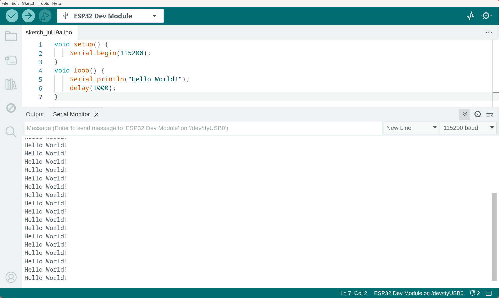
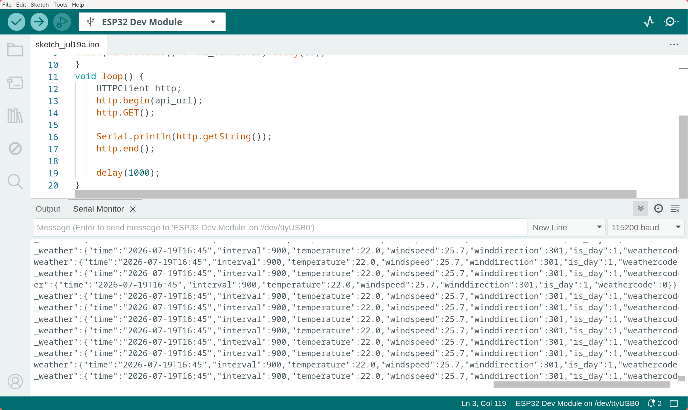
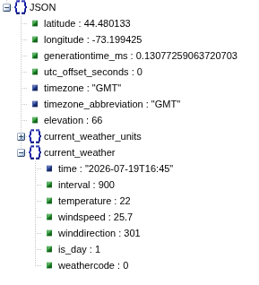
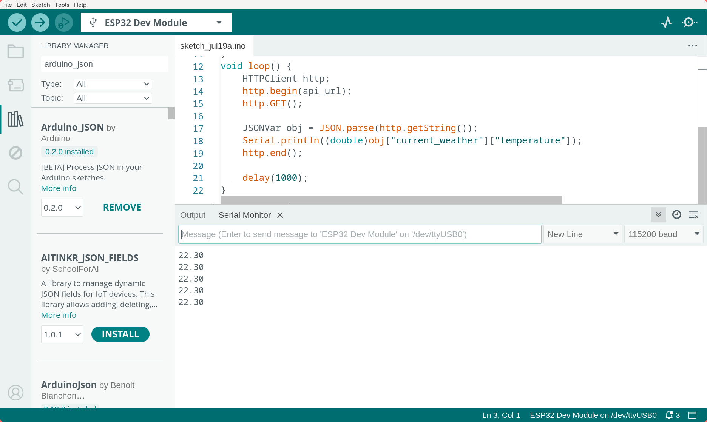
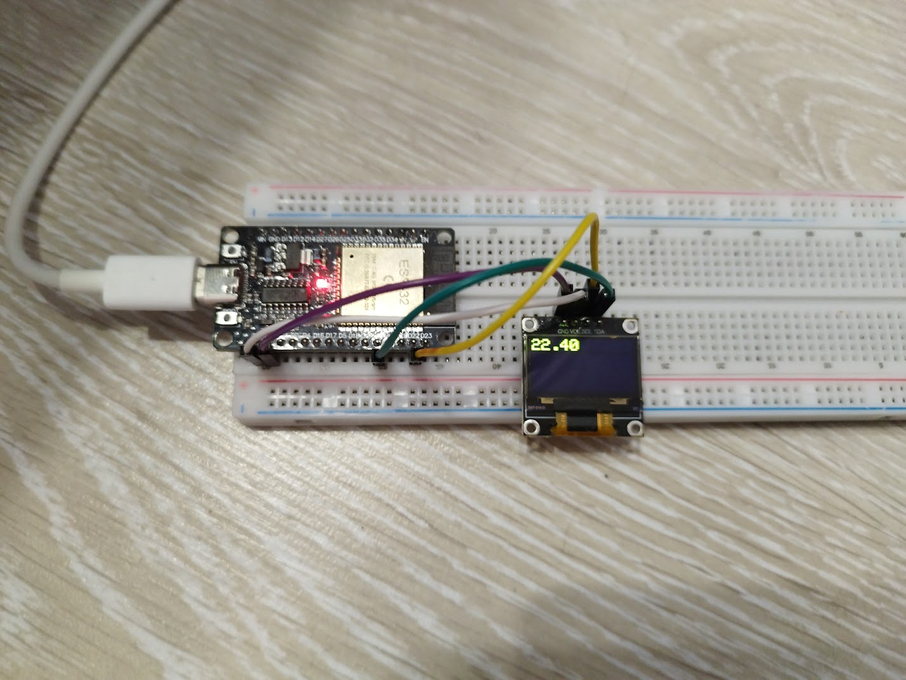

# Making a weather app for an ESP32 in C++

|||
|-|-|
|difficulty|★★★☆☆|
|time|~2hr|
|requirements|basic knowledge of C++*, Arduino IDE set up for ESP32** and some components\***|

\*you can learn the basics of C++ online! i'd recommend [SoloLearn](https://www.sololearn.com/en/), that's what i used back in the day (along with some help from my IT teacher haha)

\**Take a look at https://docs.espressif.com/projects/arduino-esp32/en/latest/installing.html for instructions on how to make an ESP32 app!

\***You'll need an ESP32D0 (ofc), an SSD1306 display (i<sup>2</sup>c ver) and some jumper wires. You can find those at basically any components store!! (Just make sure to buy the human-friendly boards and not modules that go in actual products haha)

---

ESP32 is a very popular platform for tinkerers to develop for and play and learn with. It's basically an Arduino, if you've heard what that is, but with Bluetooth, WiFi and a LOT more power, and also somehow cheaper!! It's what I'd recommend starting learning hardware with.

We will be making a small weather display that fetches the weather data for your city using WiFi and displays it on the SSD1306 display!

This tutorial assumes you know the basics of C++. Some relatively complex concepts will be explained, but generally I'd recommend that you don't use this one if you're not familiar with the language.

With that, [let's we go, amigo](https://rhwiki.net/wiki/Tibby#Description)!

## Hello World!

Let's start with a simple Hello World example. Here's what we will be starting with:

```cpp
void setup() {
    Serial.begin(115200);
}
void loop() {
    Serial.println("Hello World!");
    delay(1000);
}
```

Let's go through all major parts of the code:

- `void setup()` is run once at startup.
- `void loop()` is run repeatedly, each next iteration is run right after the last one finishes.
- `Serial.begin(115200)` initializes the serial, which is a very simple protocol for communicating with other devices, in this case with your computer over USB, at a rate of 115200bps, which is pretty much the default one for ESP32, though it can be overriden in case you need to communicate at a higher speed.
- `Serial.println("Hello World!")` sends the data over serial to your computer.
- `delay(1000)` blocks code execution for a second (1000ms).

Hopefully you understand what this does now. Connect the ESP32 to your computer via USB (most of them support communication over USB using serial), then at the top of your Arduino IDE window where you're writing the code select the box that says "Select Device" and find your device there, select the appropriate ESP32 type (most likely "ESP32 Dev Module") and click OK.

> Note: you might need to install the appropriate drivers if you're on Windows, or set up the udev rules (google it) on Linux. ~~(extremely rare macOS W)~~

Then click "Upload" (the arrow on the left)! You shoudl see a terminal pop up with the upload progress. Once that's done, click the "Serial monitor" icon (the magnifying glass one on the right) and see your ESP output the string "Hello World" every second!

> Note: don't forget to change the baud rate to 115200.



## Fetching the weather info

Now let's connect to WiFi and fetch the weather information. First, let's set the needed variables at the top of your code as well as include the WiFi and HTTP libraries:

```cpp
#include <WiFi.h>
#include <HTTPClient.h>
const char* api_url = "https://api.open-meteo.com/v1/forecast?latitude=44.476&longitude=-73.212&current_weather=true";
const char* wifi_name = "Example";
const char* wifi_password = "iwanttocheese";
```

- `const char*` is basically the string type in C++.
- Adjust the coordinates in the URL to your own!

Now, let's connect to WiFi! Add this to the setup code:

```cpp
// ...
WiFi.begin(wifi_name, wifi_password);
while(WiFi.status() != WL_CONNECTED) delay(10);
```

- The loop here waits for the WiFi connection and blocks all code execution until WiFi is connected. If your code seems to be stuck, check the WiFi settings!

Then, let's actually fetch the weather info! Change your loop code to this:

```cpp
void loop() {
    HTTPClient http;
    http.begin(api_url);
    http.GET();

    Serial.println(http.getString());
    http.end();

    delay(5000);
}
```

You should now see that the ESP outputs some JSON-formatted data in the terminal:



But we want our display to be pretty, right? So let's parse it...

## Enter Arduino_JSON

Arduino_JSON is a library that allows you to parse JSON on Arduino-compatible devices. It's very esay to use with C++, and can be installed via Arduino IDE. Head over to the libraries tab (using the selector on the left) and search for Arduino_JSON by Arduino (not the one by Benoit!). Install it.

Now, let's actually use it! Include the library in your code:

```cpp
#include <Arduino_JSON.h>
```

and parse the JSON:

```cpp
JSONVar obj = JSON.parse(http.getString());
Serial.println((double)obj["current_weather"]["temperature"]);
// ...
```

Here we basically save the parsed output to a `JSONVar` variable named `obj` and get the value `.current_weather.temperature` from it. JSON is like a tree -- sub-objects can branch out into different objects, and it can look something like this:



Hence we get the `temperature` property of the `current_weather` sub-object.

Anyway, here's an extra exercise for you: display the wind speed next to the temperature and get the units of the temperature and wind speed and display them too. If you wanna do this, you might wanna take another look at the resulting object.

Anyway, run the code now and look at the result:



## Okay, but what about the display?

I'm assuming you have an SSD1306 already. Connect it to your ESP32 like this:


Then, install another library! This one will allow you to interface with the display. It's called Adafruit SSD1306. Find it in the library manager and install it (with dependencies).

Incude a couple more libraries at the top of your code...

```cpp
#include <Wire.h>
#include <Adafruit_GFX.h>
#include <Adafruit_SSD1306.h>
```

...initialize the display...

```cpp
Adafruit_SSD1306 display(128, 64, &Wire, -1);

void setup() {
    display.begin(SSD1306_SWITCHCAPVCC, 0x3c);
    display.setTextColor(SSD1306_WHITE);
    display.setTextSize(2);
    // ...
}
```

- `Adafruit_SSD1306 display(128, 64, &Wire, -1)` creates a `display` object that's used to control the display.
- `display.begin(SSD1306_SWITCHCAPVCC, 0x3c)` sends a few commands to the display to let it know that we're about to start communicating with it. If this doesn't work, try using `0x3d`.
- `display.setTextColor(SSD1306_WHITE)` is necessary since the default color is black for whatever reason.
- `display.setTextSize(2)` is not necessary but makes the text more readable.

...and write stuff to the screen!

```cpp
void loop() {
    // ...
    display.clearDisplay();
    display.setCursor(0, 0);
    display.println((double)obj["current_weather"]["temperature"]);
    display.display();
    // ...
    delay(60000);
}
```

- `display.clearDisplay()` clears the display (duh).
- `display.setCursor(0, 0)` moves the cursor to the upper left corner of the screen. It's changed after `print` so it's kinda necessary to do this.
- `display.println(...)` prints the text to the screen.
- `display.display()` copies the data to the display.
- `delay(60000)` makes sure we don't overload the server.

With that, it should be working!!



## And that's it!!

You now know the very bare basics of Arduino and ESP32. To learn more, use google! There's not much else I can teach you. Oh, and you can also check out what you can do with the SSD1306 [here](https://github.com/adafruit/Adafruit_SSD1306/blob/master/examples/ssd1306_128x64_i2c/ssd1306_128x64_i2c.ino).

To port your app to the Cardputer, use [M5Stack's Arduino libraries](https://docs.m5stack.com/en/arduino/m5cardputer/program). It's also made for C++. Shouldn't be too hard -- it's literally the same framework.

Good luck on your project!!!!