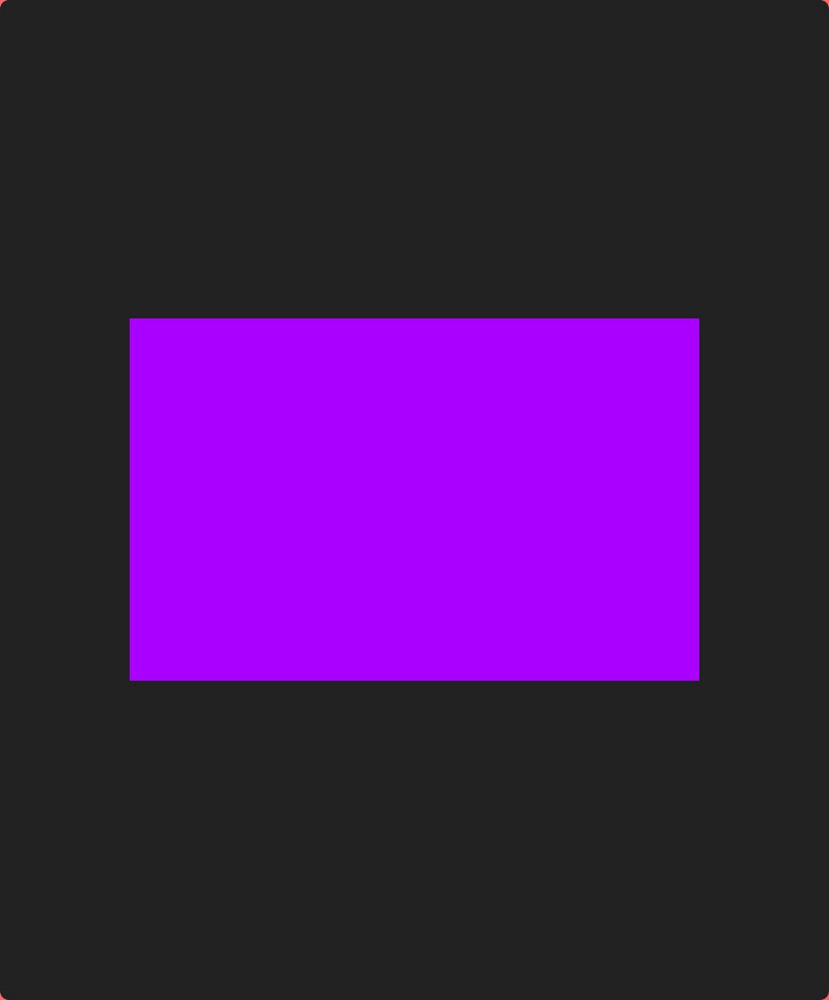
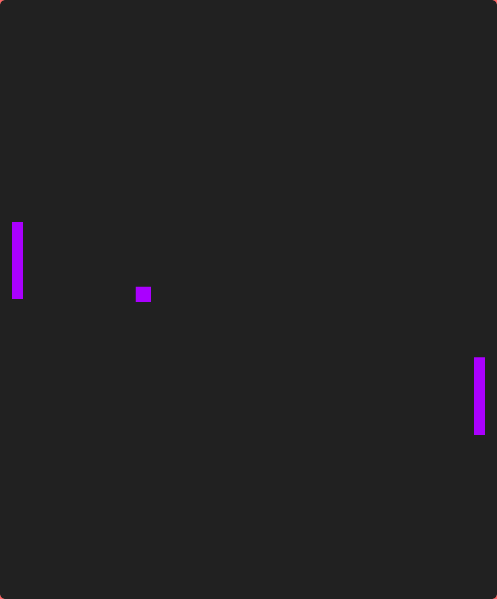
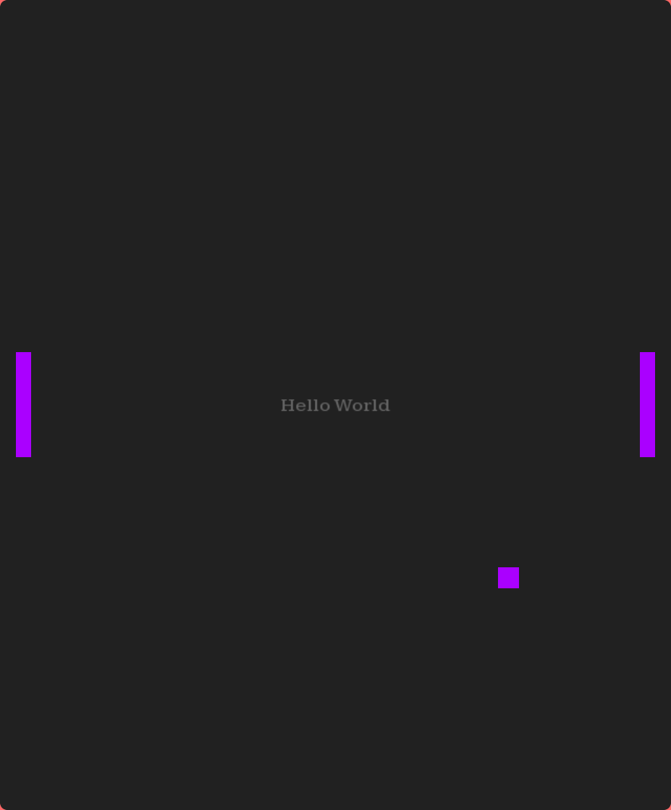
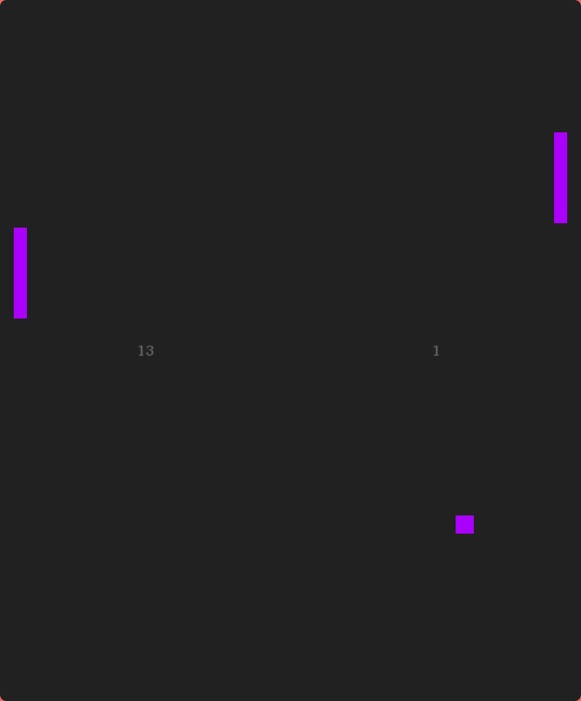

# Making an SDL3 game in C++

|||
|-|-|
|difficulty|★★★★☆|
|time|~2hr|
|requirements|basic knowledge of C++*|

\*you can learn the basics of C++ online! i'd recommend [SoloLearn](https://www.sololearn.com/en/), that's what i used back in the day (along with some help from my IT teacher haha)

SDL is a relatively low-level graphics library mostly for C/C++, although it does have bindings for basically every single language out there. Due to being low-level, I think it's a very good option to choose if you have some grasp on programming as it will be way easier to port your app to the cardputer eventually. This guide will cover making a simple Pong-like game using SDL and C++.

This tutorial assumes you know the basics of C++. Some complex concepts will be explained, but generally I'd recommend that you don't use this one if you're not familiar with the language.

With that, [let's we go, amigo](https://rhwiki.net/wiki/Tibby#Description)!

## Rectangle

First, let's initialize our app. Quite a lot of functions are used for this, though -- I'll explain them after the code.

```cpp
#define SDL_MAIN_USE_CALLBACKS 1
#include <SDL3/SDL.h>
#include <SDL3/SDL_main.h>

static SDL_Window* window = NULL;
static SDL_Renderer* renderer = NULL;

SDL_AppResult SDL_AppInit(void** appstate, int argc, char* argv[]) {
    SDL_Init(SDL_INIT_VIDEO);

    SDL_CreateWindowAndRenderer("Portputer pong example", 640, 480, SDL_WINDOW_RESIZABLE, &window, &renderer);
    SDL_SetRenderLogicalPresentation(renderer, 640, 480, SDL_LOGICAL_PRESENTATION_LETTERBOX);

    return SDL_APP_CONTINUE;
}

SDL_AppResult SDL_AppEvent(void* appstate, SDL_Event* event) {
    if(event->type == SDL_EVENT_QUIT)
        return SDL_APP_SUCCESS;
    return SDL_APP_CONTINUE;
}

SDL_AppResult SDL_AppIterate(void* appstate) {
    SDL_FRect rect;

    SDL_SetRenderDrawColor(renderer, 33, 33, 33, SDL_ALPHA_OPAQUE);
    SDL_RenderClear(renderer);

    SDL_SetRenderDrawColor(renderer, 170, 0, 255, SDL_ALPHA_OPAQUE);
    rect.x = rect.y = 100;
    rect.w = 440;
    rect.h = 280;
    SDL_RenderFillRect(renderer, &rect);

    SDL_RenderPresent(renderer);

    return SDL_APP_CONTINUE;
}

void SDL_AppQuit(void* appstate, SDL_AppResult result) {}
```

Woah, that's quite a lot isn't it? Thankfully SDL is quite verbose and self-explanatory with its function and type names, but let's go over the program just in case:

- `#define SDL_MAIN_USE_CALLBACKS 1` basically tells SDL to define its own `int main()` function that you'd normally have to define yourself in the code. If you know some C++, I'm sure you've seen the `int main()` in the code examples, but here you don't have to define it.
- `SDL_AppResult SDL_AppInit(void** appstate, int argc, char* argv[])`, `SDL_AppResult SDL_AppEvent(void* appstate, SDL_Event* event)` and `SDL_AppResult SDL_AppIterate(void* appstate)` are all callbacks that you'd define in an SDL program that handle different stages of the app. `SDL_AppInit` runs once at startup, `SDL_AppEvent` handles incoming events like keypresses or, in this case, the user clicking on the "close window" button. `SDL_AppIterate` (usually) runs every rendering frame. These functions have to return `SDL_APP_CONTINUE` to keep the app running, or something else to stop it.
- `SDL_Init` and `SDL_CreateWindowAndRenderer` are hopefully self-explanatory.
- `SDL_SetRenderLogicalPresentation` sets the internal resolution of the window. SDL will first render at that resolution, then stretch to fit the size of the window. If you want to get as close as possible to the cardputer, pass `240, 135` as the arguments.
- `SDL_EVENT_QUIT` is the window close event.
- `SDL_FRect` is a type used to describe a rectangle in SDL.
- `SDL_RenderPresent` is used to push the frame to the display.
- `SDL_AppQuit` is empty here but that's were you'd deinitialize all allocated buffers, maybe if you were using a library.

Compile the code using:

```bash
g++ example.cpp -o example -lSDL3 && ./example
```

<small>(note: may differ for macOS and especially Windows)</small>

and run it. You should see a window with a purple rectange:



## Handling keypresses
Great, you've got a rectangle rendered!! But you won't be able to play pong without any kind of controls. Hence you should implement keyboard controls! We've already got just the tool for that -- the `SDL_AppEvent` function. It can handle keypresses and change the color of our rectangle. Let's do just that!

First, let's create a variable to keep track of the red channel's value for the color of our rectangle and whether the space key is pressed on the keyboard and also the last time it was handled:

```cpp
int red = 0;
bool space_pressed = false;
uint64_t last_handled = 0;
```

Now, let's handle the actual keypresses!

```cpp
if(event->type == SDL_EVENT_KEY_DOWN) {
    if(event->key.key == SDLK_SPACE) space_pressed = true;
} else if(event->type == SDL_EVENT_KEY_UP) {
    if(event->key.key == SDLK_SPACE) space_pressed = false;
}
```

And finally, let's actually change the color in our loop code:

```cpp
if(space_pressed && SDL_GetTicks() - last_handled > 10) {
    red++;
    last_handled = SDL_GetTicks();
}
SDL_SetRenderDrawColor(renderer, red, 0, 255, SDL_ALPHA_OPAQUE); // replace that one line with this one
```

Compile the program and run it, you should now be able to hold down the space key and see the color gradually change!

## Pong

Let's start making the pong part of the game!! First, let's draw two platforms and add variables for changing their position:

```cpp
int pos_left = 190;
int pos_right = 190;

// ...

SDL_AppResult SDL_AppIterate(void* appstate) {
    SDL_SetRenderDrawColor(renderer, 33, 33, 33, SDL_ALPHA_OPAQUE);
    SDL_RenderClear(renderer);

    SDL_SetRenderDrawColor(renderer, 170, 0, 255, SDL_ALPHA_OPAQUE);
    SDL_FRect rect_l, rect_r;
    rect_l.w = rect_r.w = 15;
    rect_l.h = rect_r.h = 100;
    rect_l.x = 15; rect_r.x = 610;
    rect_l.y = pos_left; rect_r.y = pos_right;
    SDL_RenderFillRect(renderer, &rect_l);
    SDL_RenderFillRect(renderer, &rect_r);

    SDL_RenderPresent(renderer);

    return SDL_APP_CONTINUE;
}
```

(Here I'm doing some math in advance -- 190 is half of the window's height minus half of the platform's height, 610 is the platform's width plus 15 pixels away from the right edge)

Then, let's let the two players that are gonna be playing actually move the platforms! We can do this by adding more keys to the keypress handler:

```cpp
bool key_l_up = false;
bool key_l_dn = false;
bool key_r_up = false;
bool key_r_dn = false;

// you could use macros here!!
SDL_AppResult SDL_AppEvent(void* appstate, SDL_Event* event) {
    // ...
    if(event->type == SDL_EVENT_KEY_DOWN) {
        if(event->key.key == SDLK_W) key_l_up = true;
        if(event->key.key == SDLK_S) key_l_dn = true;
        if(event->key.key == SDLK_I) key_r_up = true;
        if(event->key.key == SDLK_K) key_r_dn = true;
    } else if(event->type == SDL_EVENT_KEY_UP) {
        if(event->key.key == SDLK_W) key_l_up = false;
        if(event->key.key == SDLK_S) key_l_dn = false;
        if(event->key.key == SDLK_I) key_r_up = false;
        if(event->key.key == SDLK_K) key_r_dn = false;
    }
    // ...
}
```

And finally, let's update the positions!

```cpp
// for std::clamp
#include <algorithm>

if(SDL_GetTicks() - last_handled > 10) {
    if(key_l_up) pos_left -= 5;
    if(key_l_dn) pos_left += 5;
    if(key_r_up) pos_right -= 5;
    if(key_r_dn) pos_right += 5;

    pos_left = std::clamp(pos_left, 0, 380);
    pos_right = std::clamp(pos_right, 0, 380);

    last_handled = SDL_GetTicks();
}
```

Great, awesome, epiku a! But we don't have the ball. We need to add the ball. But it's going to be... a cube. SDL3 doesn't natively have functions for more complex graphics. SDL_gfx does, though! So if you really want to, you can just use that.

Anyway, let's add some variables that would determine the ball's position and velocity and update them accordingly:

```cpp
int ball_x = 320;
int ball_y = 240;

int ball_vx = 3;
int ball_vy = 3;
int ball_vym = 1; // velocity Y multiplier

// ...

SDL_AppResult SDL_AppIterate(void* appstate) {
    if(SDL_GetTicks() - last_handled > 10) {
        ball_x += ball_vx;
        ball_y += ball_vy * ball_vym;

        if(ball_y <= 0 || ball_y >= 480) {
            ball_vy = ball_y <= 0 ? 3 : -3;
            ball_vym = 1;
        }
        if((ball_x <= 30 && pos_left <= ball_y && ball_y <= pos_left + 100)
                || (ball_x >= 610 && pos_right <= ball_y && ball_y <= pos_right + 100)) {
            ball_vx = ball_x <= 30 ? 3 : -3;
            // edge hit detection
            if((ball_x <= 30 && (pos_left + 80 <= ball_y || ball_y <= pos_left + 20))
                    || (ball_x >= 610 && (pos_right + 80 <= ball_y || ball_y <= pos_right + 20)))
                ball_vym = 2;
        } else if(ball_x <= 0 || ball_x >= 640) {
            // TODO: game over detection
            ball_x = 320;
            ball_y = 240;
            ball_vx = ball_vy = 3;
            ball_vym = 1;
        }
        // ...
    }
    // ...
    SDL_FRect rect_ball;
    rect_ball.w = rect_ball.h = 20;
    rect_ball.x = ball_x - 10;
    rect_ball.y = ball_y - 10;
    SDL_RenderFillRect(renderer, &rect_ball);
    // ...
}
// ...
```

Nothing too complicated here, just a bunch of 5th grade level math. But hey, you can play pong now!!



...assuming you know how to count the score yourself. There's no scoring system. Let's make one then!

## Hello World! (really? this late?)

Yes, this late. Funnily enough, SDL doesn't have any text rendering tools. SDL_ttf does, though! Install it (google the specific instructions for your distro/OS) and use it in your code like this:

```cpp
#include <SDL3_ttf/SDL_ttf.h>
static TTF_Font* font = NULL;

// ...

SDL_AppResult SDL_AppInit(void** appstate, int argc, char* argv[]) {
    // ...
    TTF_Init();
    font = TTF_OpenFont("font.ttf", 18.0f);
}

// ...

SDL_AppResult SDL_AppIterate(void* appstate) {
    SDL_Surface* text = TTF_RenderText_Blended(font, "Hello World", 0, (SDL_Color){ 100, 100, 100, SDL_ALPHA_OPAQUE });
    SDL_Texture* texture = SDL_CreateTextureFromSurface(renderer, text);
    SDL_DestroySurface(text);
    SDL_FRect rect_text;
    SDL_GetTextureSize(texture, &rect_text.w, &rect_text.h);
    rect_text.x = 320 - rect_text.w / 2; rect_text.y = 240 - rect_text.h / 2;
    SDL_RenderTexture(renderer, texture, NULL, &rect_text);
    SDL_DestroyTexture(texture);

    // ...
}
```

Don't forget to pass the new library to the compiler!

```bash
g++ ex.cpp -o ex -lSDL3 -lSDL3_ttf
```

Run the program, and you'll see that there's a faintly visible text in the middle of the screen:



## Score

It shouldn't be too hard to render the score now. Let's initialize the score variables...

```bash
unsigned int score_left = 0;
unsigned int score_right = 0;
```

...and render the score on either side of the screen!! (And also update it haha)

```cpp
#include <string>
// ...
SDL_AppResult SDL_AppIterate(void* appstate) {
    SDL_Surface* text_left = TTF_RenderText_Blended(font, std::to_string(score_left).c_str(), 0, (SDL_Color){ 100, 100, 100, SDL_ALPHA_OPAQUE });
    SDL_Surface* text_right = TTF_RenderText_Blended(font, std::to_string(score_right).c_str(), 0, (SDL_Color){ 100, 100, 100, SDL_ALPHA_OPAQUE });
    SDL_Texture* texture_left = SDL_CreateTextureFromSurface(renderer, text_left);
    SDL_Texture* texture_right = SDL_CreateTextureFromSurface(renderer, text_right);
    SDL_DestroySurface(text_left); SDL_DestroySurface(text_right);
    SDL_FRect rect_text_left, rect_text_right;
    SDL_GetTextureSize(texture_left, &rect_text_left.w, &rect_text_left.h);
    SDL_GetTextureSize(texture_right, &rect_text_right.w, &rect_text_right.h);
    rect_text_left.x = 160 - rect_text_left.w / 2; rect_text_right.x = 480 - rect_text_right.w / 2;
    rect_text_left.y = 240 - rect_text_left.h / 2;
    rect_text_right.y = 240 - rect_text_right.h / 2;
    SDL_RenderTexture(renderer, texture_left, NULL, &rect_text_left);
    SDL_RenderTexture(renderer, texture_right, NULL, &rect_text_right);
    SDL_DestroyTexture(texture_left);
    SDL_DestroyTexture(texture_right);

    // ...
}
```

note: here i'm using `std::to_string()` which returns a C++ string which we have to convert to a C string due to how SDL is a C library.

```cpp
else if(ball_x <= 0 || ball_x >= 640) {
    if(ball_x <= 0) score_right++;
    else score_left++;
    // ...
}
```

Once again, the code is pretty much self-explanatory. With that, you should now be able to see the score:



## And that's it!!

You now know the very bare basics of SDL3. To learn more, go to [SDL's official documentation](https://wiki.libsdl.org/SDL3/FrontPage) -- it shouldn't be too complicated to implement anything you need in your app. Also, don't be afraid to use Google!

To port your app to the Cardputer, use [M5Stack's Arduino libraries](https://docs.m5stack.com/en/arduino/m5cardputer/program). It's also made for C++, and is in some ways WAYY easier to use than SDL.

Good luck on your project!!!!