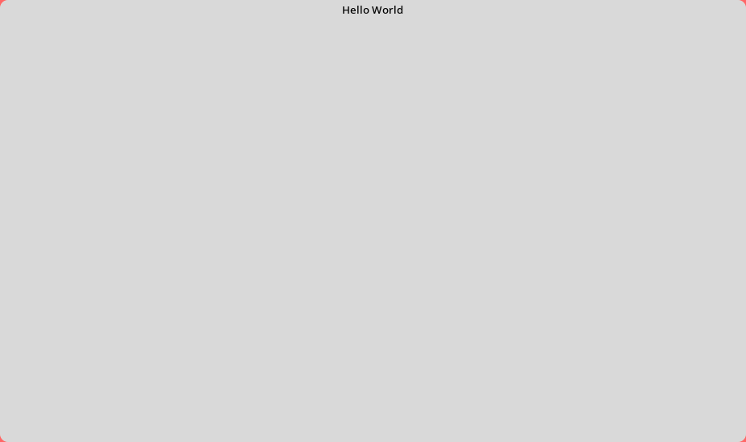
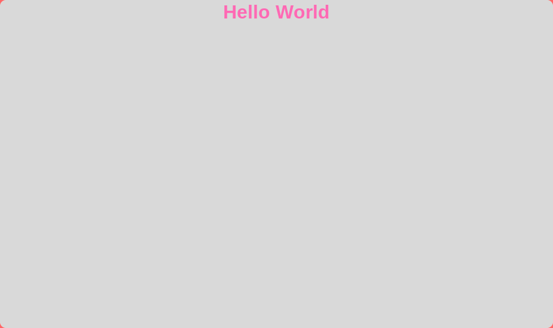
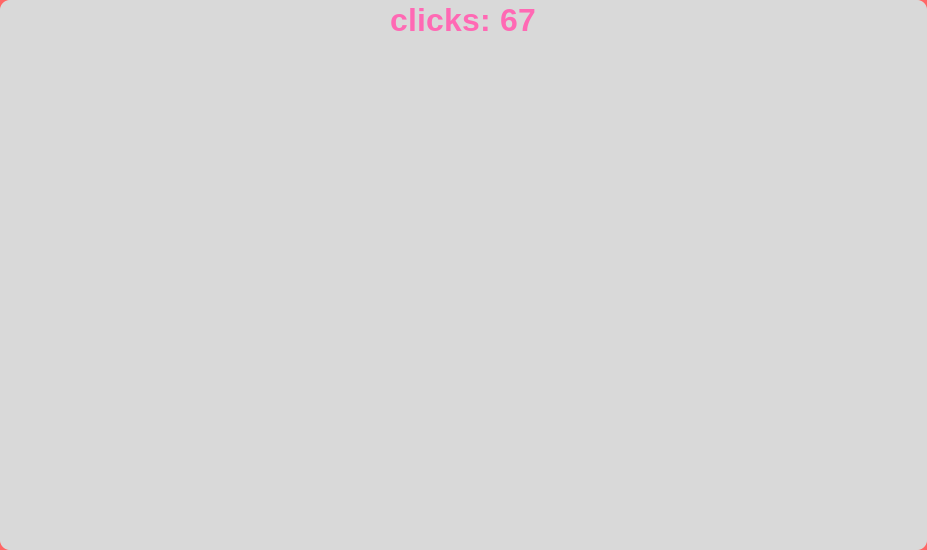
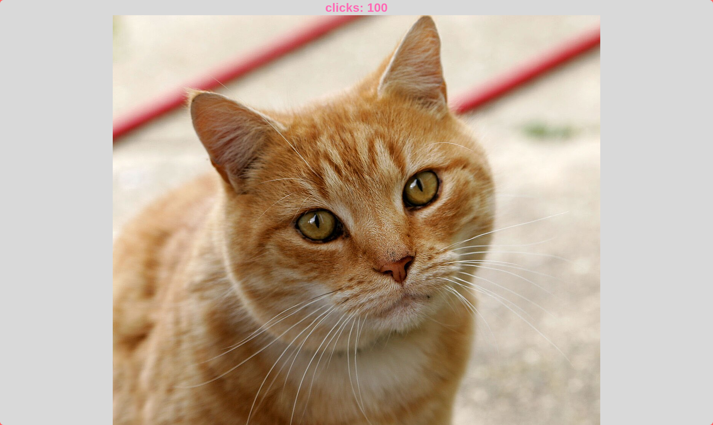

# Making a Python-based desktop app with Tkinter

|||
|-|-|
|difficulty|★★☆☆☆|
|time|~1hr|
|requirements|basic knowledge of Python*|

\*you can learn the basics of Python online! i'd recommend [SoloLearn](https://www.sololearn.com/en/), that's what i used back in the day

Tkinter is a very simple and easy-to-use Python library made for building desktop applications. In this tutorial, we'll be making a very simple clicker game as a training project!

This tutorial assumes you know some Python already. Don't worry, not that much knowledge is required -- even if you don't know how to use imports or define your own functions, this guide will cover that!

With that, [let's we go, amigo](https://rhwiki.net/wiki/Tibby#Description)!

## Hello World!
First, let's start with the simplest app we can make with Tkinter:

```py
import tkinter as tk

root = tk.Tk()
root.mainloop()
```

Save that to a `.py` file and run it (double click on Windows, `python3 yourfile.py` from the terminal on macOS/Linux). A window will pop up!


As you can probably see, not much is happening here, and it's not surprising -- we haven't added anything to the script yet, have we? :D

Before we add more stuff though, let's go through what this does though:

- `import tkinter as tk` imports a library called `tkinter` and saves it to a variable named `tk`. A library is basically a bunch of code external to your main script. This library comes with Python, so basically you're loading code made by the developers behind Python into your own program. We don't care about what it's made of, but we do care about what functions we can use to interface with the provided code, and we access said functions via the `tk` variable.
- `root = tk.Tk()` creates the window. This is where we start interfacing with the library, and we do that by calling a function from that library that constructs a window for our program. We will have to interact with it later though, so we save the output of the function to a variable called `root`.
- `root.mainloop()` starts the main loop of the window. You'll see what this means a bit later on, but basically it handles things like clicks and keypresses and passes them to our code. We haven't added any code that would handle that though... yet.

Pretty simple once you understand it, right?

Anyway, I'm sure looking at a blank window is not the best kind of entertainment, so let's add some text now! We can do it by adding a `Label`, which is basically just something that can display text:

```py
import tkinter as tk

root = tk.Tk()
tk.Label(root, text="Hello World").pack() # add this!
root.mainloop()
```

This is pretty simple to understand, we create a `Label` that's linked to our window, `root`, with the text `"Hello World"`. Just for completeness's sake though, let me explain what `.pack()` means. Right after creating a `Label`, we call a method on it called `pack`, and that method basically positions the `Label` in the window so that it's visible and properly positioned -- in this case, at the top of the window, horizontally centered.

Run the file once again and observe the result!!



## Goodbye world??

Now that we can display text, it's time to change it up a bit!.. literally. We'll change the text in the `Label` when space is pressed. Let's first modify the code a bit to save the `Label` into a variable we can work with later:

```py
import tkinter as tk

root = tk.Tk()
label = tk.Label(root, text="Hello World")
label.pack()
root.mainloop()
```

As you can see, we first save the variable and then call `.pack()` on that variable. The `pack` function itself doesn't return anything, so even if we were to save its output to `label` it would just be empty.

Now we need to somehow capture the keypresses. Luckily, Tkinter makes it easy to do just that! First, let's create a function by using `def`:

```py
# ...
label = tk.Label(root, text="Hello World")
label.pack()

def goodbye_world(event):
    global label
    label.config(text="Goodbye world :(")
root.bind("<space>", goodbye_world)

root.mainloop()
```

Here:

- `def goodbye_world(event)` defines a function to be called by Tkinter. If we were Tkinter, we'd call this function by using `goodbye_world(event)`, where `event` is the event variable created by Tkinter. Fortunately or not though, we don't make Tkinter, which is why we just pass this function to it. The `event` variable is unused but it has to be there because Python is stupid and doesn't allow for extra arguments unlike my beloved TypeScript.
- `global label` basically just takes the `label` variable we defined earlier and makes it accessible from within the function. This is not always necessary but is good programming practice.
- `label.config(text="Goodbye world :(")` updates the label's text to `"Goodbye world :("`. Tkinter can't automatically detect changes in the variables so we have to call a function to update it rather than just setting `label.text` to that.
- `root.bind("<space>", goodbye_world)` passes our function to Tkinter and tells it to call it when the space key is pressed. Note that we don't call the function so we don't include `()` after the name, that'd instantly update the text and potentially break Tkinter.

Try updating the code and pressing space while focused on the window! The text should change.


## Styles!!!

You might have gotten bored of looking at this text... because it's not pink and pretty™!! Let's make it pink and pretty™. We'll do this by applying custom properties to the `Label` that would change its color, size and weight. Let's update the line that creates the text:

```py
label = tk.Label(root, text="Hello World", fg="hotpink", font=("Arial", 24, "bold"))
```

Yes, that's pretty much all you have to do! It's just passing more options to the constructor. Here,

- `fg="hotpink"` is the ForeGround color, which is hot pink. You can see all the tkinter colors [here](https://cs111.wellesley.edu/archive/cs111_fall14/public_html/labs/lab12/tkintercolor.html).
- `font=("Arial", 24, "bold")`, obviously, tells Tkinter what font to use. `"Arial"` is preinstalled on pretty much every system out there, so that's what I chose; `24` is the size (in pt?) and `"bold"` is the thickness, or weight, of the font. You can pass any other font here, change the size, or make it `"regular"`-thick.

Run the app again and observe the results!



## Starting making the app

We wanted to make a clicker game, right. Obviously we wanna add a counter of the clicks, or should I say, keypresses. Let's do just that:

```py
import tkinter as tk

counter = 0 # Starting with zero clicks
# ...
```

Then we'll update the text:

```py
label = tk.Label(root, text="clicks: 0", fg="hotpink", font=("Arial", 24, "bold"))
```

I don't think either of these require much explanation. We'll modify the handler next:

```py
def click(event):
    global label, counter
    counter += 1
    label.config(text="clicks: " + str(counter))
root.bind("<space>", click)
```

Here, I renamed the function to `click`, added `counter` as a global variable (yes, you *can* do `global label, counter` and not `global label` `global counter`), increment it by 1 each click and update the text (note: Python is still stupid so `str()` is required to convert the number to text)

Now you should be able to run the code and see that the counter changes upon pressing space:



## Adding images

Okay, we might wanna reward the user for reaching 100 clicks somehow. And what better way to reward people is there than showing them cat pictures?

[Download this image](https://upload.wikimedia.org/wikipedia/commons/thumb/3/3a/Cat03.jpg/1280px-Cat03.jpg?utm_source=en.wiktionary.org&utm_campaign=index&utm_content=thumbnail) and save it to `cat.png` next to the script. Then, let's add the image after the user reaches 100 clicks to the window:

```py
def click(event):
    global label, counter, root # add root here!
    counter += 1
    label.config(text="clicks: " + str(counter))

    if counter == 100: # not >=, that'd add the cat every click after 100
        img = tk.PhotoImage(file="cat.png")
        img_label = tk.Label(root, image=img)
        img_label.keepalive = img
        img_label.pack()
```

I don't think I need to explain the `if counter == 100` part, so let's get straight to the point:

- `img = tk.PhotoImage(file="cat.png")` loads the image and saves it to our variable `img` in a format readable by Tkinter.
- `img_label = tk.Label(root, image=img)` creates a `Label` that has the image in it. Yes! They can hold images!!
- `img_label.keepalive = img` is a bit hard to explain, but basically Python clears our image from memory as soon as we leave the loop, so we have to link it to a variable that certainly won't get deleted to keep it alive.
- `img_label.pack()` should be obvious haha

Try running the code now! It should show you the cat after 100 clicks:



## And that's it!!

You now know the very bare basics of Tkinter. To learn more, go to [Python's official Tkinter documentation](https://docs.python.org/3/library/tkinter.html) -- it might seem complicated at first, but they do provide examples that should help you implement what you need. Also, don't be afraid to use Google!

To port your app to the Cardputer, use [M5Stack's UIFlow2 toolkit](https://uiflow2.m5stack.com/). It supports a lot of M5Stack's devices, including the Cardputer, and lets you make apps with Python! You'll have to do a bit of researrch on that yourself, but it shouldn't be too complicated :D

Good luck on your project!!!!